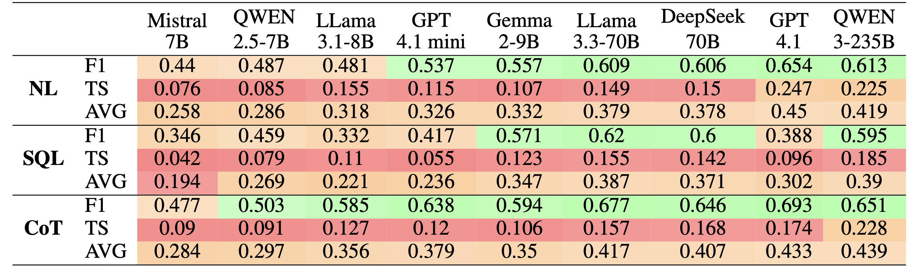
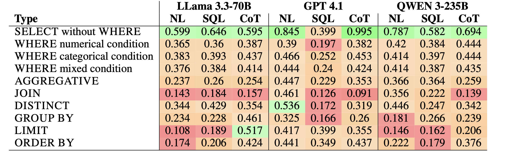
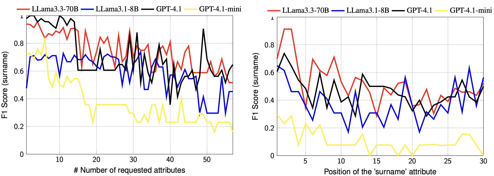

# 📊 RelationalFactQA: A Benchmark for Evaluating Tabular Fact Retrieval from Large Language Models

RelationalFactQA dataset repository.

## 📝 Paper

This is the repository of the [RelationalFactQA: A Benchmark for Evaluating Tabular Fact Retrieval from Large Language Models](https://arxiv.org/abs/2505.21409) paper, published on [arXiv](https://arxiv.org/abs/2505.21409).

### Citation

```
@misc{satriani2025relationalfactqabenchmarkevaluatingtabular,
      title={RelationalFactQA: A Benchmark for Evaluating Tabular Fact Retrieval from Large Language Models},
      author={Dario Satriani and Enzo Veltri and Donatello Santoro and Paolo Papotti},
      year={2025},
      eprint={2505.21409},
      archivePrefix={arXiv},
      primaryClass={cs.CL},
      url={https://arxiv.org/abs/2505.21409},
}
```

## 🔍 Insights

RelationalFactQA is a novel benchmark featuring a 696-question hybrid dataset covering 9 knowledge domains, each triple-annotated with a NL query, its equivalent SQL statement, and a fully verified gold table.

It focuses on the _Relational Fact Retrieval_ task: the generation of structured, multi-record, multi-attribute tabular data by an LLM in response to a query, relying exclusively on the model’s internal parametric knowledge.

In contrast to existing datasets RelationalFactQA demands complex outputs, with an average of 27 tuples and 5.3 attributes per answer.

| Dataset                                          | Total # Questions | Avg # Out Tuples | Avg # Out Attributes | Avg # Out Tokens |
| ------------------------------------------------ | ----------------- | ---------------- | -------------------- | ---------------- |
| [WikiSQL](https://github.com/salesforce/WikiSQL) | 56,355            | 1.08             | 1.00                 | 3.22             |
| [WikiTableQuestions](https://github.com/ppasupat/WikiTableQuestions)                               | 14,149            | 1.08             | 1.00                 | 2.80             |
| [Open-WikiTable](https://github.com/sean0042/Open_WikiTable)                                   | 53,819            | 1.08             | 1.00                 | 3.23             |
| [TAT-QA](https://github.com/NExTplusplus/TAT-QA)                                           | 13,215            | 1.19             | n.a.                 | 6.63             |
| [TruthfulQA](https://github.com/sylinrl/TruthfulQA)                                       | 790               | 1.00             | n.a.                 | 10.49            |
| [TriviaQA](https://nlp.cs.washington.edu/triviaqa/) (unfiltered)                            | 87,622            | 1.00             | n.a.                 | 6.39             |
| **RFQA**                                         | **696**           | **26.942**       | **5.32**             | **357.09**       |

### Highlights

We organize our evaluation around three main research questions.

1. Factuality. To what extent can LLMs generate factual tables based on their internal knowledge?
2. Extraction Techniques. Are LLMs more effective at generating tabular responses from SQL
   queries compared to NL questions? Does CoT help in getting better results?
3. Query complexity. Do LLMs’ performance depend on the schema and the query complexity?



Even with different execution strategies (**N**atural **L**anguage, **SQL**, **C**hain **o**f **T**houghts) the evaluation metrics are unsatisfactory.

Each experiment is evaluated comparing the results to the ground truth using two metrics:

- F1: the F1-Score computed over the results at cell level;
- **T**uple **S**imilarity (TS): entity similarity (Edit Distance) computed over the results at tuple level.

Q1, Q2 in short: LLMs still struggle to consistently retrieve structured factual knowledge as complete output tuples. NL outperfoms slightly SQL as a retrieval method, while CoT provides benefits in most settings.



Quality degrades as query complexity increases.



Models are highly sensibile to structural complexity and attribute position.

Q3 in short: LLM performance is significantly influenced by the structure of the target schema. Both attribute type and output size are key factors in determining LLM effectiveness for tabular factual retrieval. Query complexity has also a significant impact on LLM performance.

## 📁 Dataset

The dataset is available in the [dataset](./dataset/) folder.

The [RelationalFactQA.csv](./dataset/RelationalFactQA.csv) file contains the queries, while each subfolder contains the ground truth for the query.

### Execution

Experimental results where executed using [Galois](https://github.com/dbunibas/galois/tree/reproducibility).

## 🤝🏻 References

| Authors             | Reference                                                                                                                                                                                                                         |
| ------------------- | --------------------------------------------------------------------------------------------------------------------------------------------------------------------------------------------------------------------------------- |
| D. Satriani et al.  | [Logical and Physical Optimizations for SQL Query Execution over Large Language Models](https://dl.acm.org/doi/10.1145/3725411)                                                                                                   |
| S. Papicchio et al. | [QATCH: Benchmarking SQL-centric tasks with Table Representation Learning Models on Your Data](https://proceedings.neurips.cc/paper_files/paper/2023/hash/62a24b69b820d30e9e5ad4f15ff7bf72-Abstract-Datasets_and_Benchmarks.html) |


